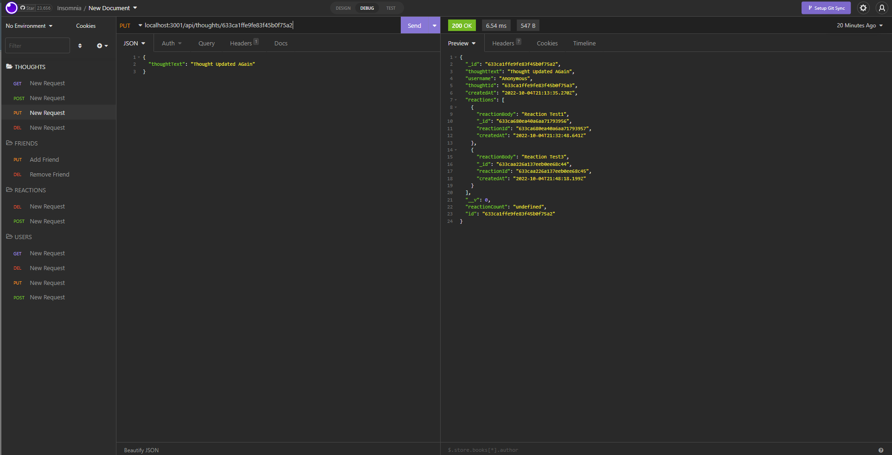

# SocialNetwork-API

## Table of Contents

- [Description](#description)
- [Refrences](#references)
- [Videos](#videos)
- [Licenses](#license)
- [Author Info](#license)

## Description
* The purpose of this application was to purpose to simulate a "social experience". There is no deployed application everything is functioned through insomnia using the SocialNetwork-API database. 

### Application Photo

## Install Instructions
none

## Credits
N/A

## Instructions/How to use

* Users will be able to create, view, edit and delete users. Users are also able to associate user profiles by adding each other as friends through the user ids. Users can also add "string" thoughts to each other profiles also allowing reactions to be made towards each thought.  

## Videos:

Walkthrough videos demonstrating functionality: 

https://drive.google.com/file/d/1xXMN5kDMzmnLdg-Eu-Ow3IFhVJzRAhGY/view

https://drive.google.com/file/d/1zr7p--s9sSrjSPJoXkKsFj-cf3iIpbl6/view

## License
Permission to use this application is granted under the MIT license. https://choosealicense.com/licenses/mit/

## Created By
[github link: korbynd23](https://github.com/korbynd23)

#### If you have any further questions on this application please feel free to contact me at kdicari24@gmail.com